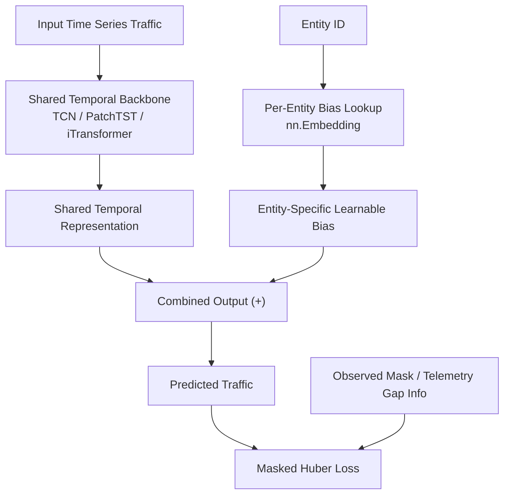

# ISPNet-CESNET24: Deep Learning for ISP-Level Network Traffic Forecasting

[](https://www.python.org/)
[](https://pytorch.org/)
[](https://opensource.org/licenses/Apache-2.0)
[](https://jupyter.org/)

This repository contains the implementation of **ISPNet**, a deep learning framework designed for large-scale, heterogeneous Internet Service Provider (ISP) network traffic forecasting, evaluated on the **CESNET-TimeSeries24** dataset.

The project models and predicts hourly network bandwidth (in bytes) across **283 institutions and subnets** for both **24-hour** and **168-hour (1 week)** horizons.

---

## 🚀 Key Highlights

* **30% - 37% Relative SMAPE Reduction** compared to standard paper benchmarks.
* **Outperforms 7 Deep Learning Baselines** (LSTM, GRU, TCN, DLinear, Transformer, PatchTST, iTransformer).
* **Robust Telemetry Handling**: Integrates mask-aware noise augmentation and a specialized Masked Huber Loss to handle telemetry gaps (1.1% missing rate) and extreme traffic spikes.

---

## 🧠 Proposed Architecture: ISPNet

Predicting traffic across hundreds of heterogeneous network entities (ranging from small research subnets to large national universities) is highly challenging. ISPNet addresses this through three core design principles:

1. **Shared Temporal Backbone**: A unified neural network (e.g., TCN, PatchTST, or iTransformer) learns the shared, complex temporal dynamics of ISP network traffic.
2. **Per-Entity Output Bias Lookup (`nn.Embedding`)**: A zero-initialized embedding layer matches the identifier of each of the 283 entities and adds an entity-specific learnable bias. This captures individual traffic baselines and scales without interfering with the shared temporal representation.
3. **ISP-Traffic-Aware Masked Huber Loss**: Configured with $\delta = 1.0$ (matching $1\text{ IQR}$ of the scaled traffic), it acts quadratically for small residuals and linearly for large spikes, preventing Telemetry gaps from biasing gradients to zero.

### Architecture Flowchart



---

## 📊 Benchmark Results

Evaluated on the test split and outage windows, **ISPNet** shows massive improvements in **SMAPE** and **$R^2$** compared to local deep learning models and paper benchmarks:

| Dataset | Horizon | Model | SMAPE (Test) | $R^2$ (Test) | SMAPE (Outage) | $R^2$ (Outage) | Relative SMAPE Improvement |
| :--- | :---: | :--- | :---: | :---: | :---: | :---: | :---: |
| **Institutions** | **24h** | Paper Best (Mean)<br>Local Best (Transformer)<br>**ISPNet (Ours)** | 97.46%<br>62.23%<br>**60.84%** | 0.027<br>-3.673<br>**0.251** | -<br>-<br>**68.09%** | -<br>-<br>**0.228** | **-37.58% vs Paper**<br>**-2.23% vs Local Best** |
| **Institutions** | **168h** | Paper Best (Mean)<br>Local Best (Transformer)<br>**ISPNet (Ours)** | 100.49%<br>71.36%<br>**67.75%** | -0.008<br>-0.205<br>**0.128** | -<br>-<br>**82.97%** | -<br>-<br>**-0.112** | **-32.58% vs Paper**<br>**-5.06% vs Local Best** |
| **Subnets** | **24h** | Paper Best (Mean)<br>Local Best (GRU)<br>**ISPNet (Ours)** | 93.03%<br>61.85%<br>**60.15%** | 0.047<br>-1949.02<br>**-4621.07** | -<br>-<br>**67.11%** | -<br>-<br>**0.138** | **-35.34% vs Paper**<br>**-2.74% vs Local Best** |
| **Subnets** | **168h** | Paper Best (Mean)<br>Local Best (Transformer)<br>**ISPNet (Ours)** | 97.93%<br>71.09%<br>**67.84%** | -0.001<br>-1481685.49<br>**-24894.48** | -<br>-<br>**83.87%** | -<br>-<br>**-0.380** | **-30.73% vs Paper**<br>**-4.58% vs Local Best** |

---

## 📂 Directory Layout

The repository is organized following professional data science project layouts:

```
ISPNet-CESNET24/
  ├── BaoCaoDoAn_TimeSeries.docx        # Graduation Thesis Report (DOCX version)
  ├── BaoCaoDoAn_TimeSeries.pdf         # Graduation Thesis Report (PDF version)
  ├── requirements.txt                  # Python package dependencies
  ├── data/                             # Data files
  │     ├── raw/                        # Original source data (ignored in git)
  │     └── preprocessed/               # Preprocessed parquets (ignored in git)
  ├── notebooks/                        # Jupyter Notebooks (Sequential Pipeline)
  │     ├── 00_raw_eda.ipynb            # Exploratory Data Analysis on raw data
  │     ├── 01_preprocessing_pipeline.ipynb # Scalers & feature engineering
  │     ├── 02_processed_eda.ipynb      # EDA on processed datasets
  │     ├── 03_classical_baselines.ipynb # Historical Mean/Median & MA baselines
  │     ├── 04_sarima_baseline.ipynb    # SARIMA forecasting
  │     ├── 05_dl_baselines_daily.ipynb # Deep Learning models (Daily Institutions)
  │     ├── 05_dl_baselines_daily_subnets.ipynb # Deep Learning models (Daily Subnets)
  │     ├── 05_dl_baselines_weekly.ipynb # Deep Learning models (Weekly Institutions)
  │     ├── 05_dl_baselines_weekly_subnets.ipynb # Deep Learning models (Weekly Subnets)
  │     ├── 06_proposed_ispnet_daily.ipynb # Proposed ISPNet (Daily Institutions)
  │     ├── 06_proposed_ispnet_daily_subnets.ipynb # Proposed ISPNet (Daily Subnets)
  │     ├── 06_proposed_ispnet_weekly.ipynb # Proposed ISPNet (Weekly Institutions)
  │     ├── 06_proposed_ispnet_weekly_subnets.ipynb # Proposed ISPNet (Weekly Subnets)
  │     └── 07_ablation_ispnet_daily.ipynb # Ablation study (Daily)
  └── results/                          # Structured outputs
        ├── baselines/                  # Classical baseline tables & plots
        ├── eda_figures/                # Visualizations from EDA notebooks
        ├── extra_analysis/             # paired entity CSVs & statistical tests
        ├── daily/                      # Daily model output (.csv metrics, curves)
        │     ├── baselines/            # DL baseline metrics
        │     ├── baselines_subnets/    # Subnets DL baseline metrics
        │     ├── proposed/             # Proposed ISPNet Daily
        │     └── proposed_subnets/     # Proposed ISPNet Daily Subnets
        └── weekly/                     # Weekly model output (.csv metrics, curves)
              ├── baselines/            # DL baseline metrics
              ├── baselines_subnets/    # Subnets DL baseline metrics
              ├── proposed/             # Proposed ISPNet Weekly
              └── proposed_subnets/     # Proposed ISPNet Weekly Subnets
```

---

## 🛠️ Getting Started

### 1. Installation & Environment Setup
Clone the repository and install the dependencies:
```bash
git clone https://github.com/nvtanphat/ISPNet-CESNET24.git
cd ISPNet-CESNET24
pip install -r requirements.txt
```

### 2. Dataset Setup
You can set up the dataset in one of two ways:

* **Option A: Preprocessed Dataset (Recommended & Faster)**:
  Download our preprocessed dataset directly from [Kaggle: CESNET-TimeSeries24 Preprocessed](https://www.kaggle.com/datasets/nguynvntnpht/cesnet-timeseries24-preprocessed) and extract the contents into the `data/preprocessed/` directory. This allows you to skip the preprocessing notebooks and start running the model code directly.

* **Option B: Raw Dataset**:
  1. Download the raw **CESNET-TimeSeries24** dataset from the official [Nature Scientific Data Paper](https://www.nature.com/articles/s41597-025-04603-x).
  2. Extract the dataset files into the `data/raw/` directory.

### 3. Pipeline Execution
Run the notebooks in sequential order:
1. **Preprocessing**: (Skip this if you used Option A for dataset setup) Open and run [01_preprocessing_pipeline.ipynb](notebooks/01_preprocessing_pipeline.ipynb) to clean the telemetry and generate parquet features.
2. **Classical Baselines**: Run [03_classical_baselines.ipynb](notebooks/03_classical_baselines.ipynb) and [04_sarima_baseline.ipynb](notebooks/04_sarima_baseline.ipynb).
3. **Deep Learning Baselines**: Run the notebooks starting with `05_` to train and evaluate LSTM, GRU, TCN, PatchTST, and iTransformer.
4. **ISPNet**: Run the notebooks starting with `06_` to train the proposed ISPNet and generate comparison tables against the baselines.

---

## 📚 References

* **Official Dataset Paper**: ["CESNET-TimeSeries24: A dataset of network traffic time series at the institution and subnet level"](https://www.nature.com/articles/s41597-025-04603-x) (Scientific Data, 2025).

---

## 📜 Citation

If you find this repository or the graduation thesis helpful for your research, please cite it as:

```bibtex
@thesis{nvtanphat2026ispnet,
  author       = {Nguyen Van Tan Phat},
  title        = {Deep Learning for Large-Scale Heterogeneous ISP Network Traffic Forecasting},
  school       = {Graduation Thesis Report},
  year         = {2026},
  url          = {https://github.com/nvtanphat/ISPNet-CESNET24}
}
```

## ✉️ Contact

For any questions or collaborations, please contact:
* **Author**: Nguyen Van Tan Phat
* **GitHub**: [@nvtanphat](https://github.com/nvtanphat)
